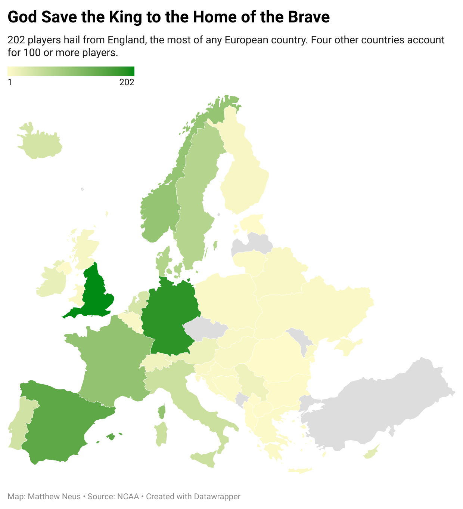

```{r,  message = FALSE, warning = FALSE}
library(tidyverse)
library(postmastr)
library(rvest)
library(ggplot2)
library(scales)
library(gt)
library(waffle)

msoc_div1_new <- read_csv("~/Downloads/MSOC Roster Data - Roster Data.csv")

```

###FRAME THIS BROAD TO SPECIFIC --\> COUNTRIES(datawrapper chart) TO POSITIONS (Already somewhat done w/ first graph w/ European countries and position data) TO PLAYERS

1,244 Division I soccer players hail from Europe. England and Germany are the two most well-represented countries, sending 202 and 186 players to collegiate soccer programs, respectively.

A majority of the European influence in Division I college soccer hails from western parts of the continent, like England, Germany, France and Spain. The further east you move across Europe, like toward the Balkan region, fewer players are tabbed by Division I programs.

Serbia brings the most players out of any Balkan country with 15.



With more than 1,200 players coming from Europe, a majority of those to make the journey across the pond play in defensive-minded positions.

England and Germany, the two countries that make up most of the European presence on collegiate soccer rosters, account for the most defenders with 80 coming from Germany and 69 coming from England.

Midfielders also frequently hail from England and Germany, alongside Spain. There are 164 midfielders at Division I programs across the three European countries.

```{r,  message = FALSE, warning = FALSE}
msoc_div1_eupos <- msoc_div1_new |>
  group_by(PositionCleaned, country) |>
  filter(Continent == "Europe") |>
  summarise(
    total = n()
  )

ggplot() + 
  geom_bar(
    data=msoc_div1_eupos, 
    aes(x=reorder(country, PositionCleaned),
        weight=total, 
        fill=PositionCleaned)) + 
  coord_flip() + 
  labs(
    title="Germany and England Are Masters in Defense",
    subtitle = "149 players hail from Germany & England, leading all countries in defense.",
    x="Country", 
    y="Number of Players") +
  theme_classic()
```

Europe dominates the defensive positions on rosters, but Africa, Asia and South America make up for a plethora of midfielders. From those three continents, 159 midfielders appear in collegiate soccer.

Forwards are more common to come from Africa or Asia, with 45 and 35 forwards, respectively.

```{r}
msoc_div1_positions <- msoc_div1_new |>
  group_by(PositionCleaned, Continent) |>
  filter(PositionCleaned == "Defense" | PositionCleaned == "Midfield" | PositionCleaned == "Forward" | PositionCleaned == "Goalie") |>
  filter(Continent == "Africa" | Continent == "Asia" | Continent == "Oceania" | Continent == "South America") |>
  summarise(
    total = n()
  )

ggplot() + 
  geom_line(data=msoc_div1_positions, aes(x=PositionCleaned, y=total, group=Continent)) + 
  scale_y_continuous(limits = c(0, 60)) + 
  facet_wrap(~Continent) + 
  labs(
    title="Africa, Asia and South America Play Through the Middle",
    subtitle = "These three continents combine for 159 midfielders",
    x="Position", 
    y="Total Number of Players") +
  theme_classic()
```
